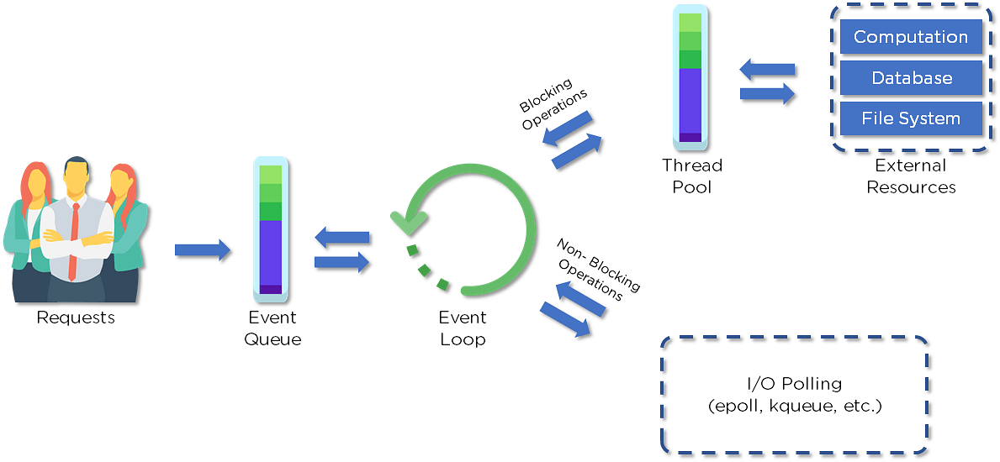

# Câu hỏi phỏng vấn Node.js

## 1. Node.js là gì?

Node.js là ứng dụng mã nguồn mở, đa nền tảng, giúp thực thi trên môi trường JavaScript và chạy các ứng dụng web bên ngoài trình duyệt. Nó được dùng để tạo ứng dụng server-side cho web.

Node.js là công cụ hoàn hảo cho các ứng dụng sử dụng nhiều dữ liệu vì nó sử dụng mô hình event-driven bất đồng bộ. Bạn có thể dùng nó cho các ứng dụng chuyên sâu I/O như các streaming. Bạn cũng có thể sử dụng nó cho các trang web real-time, ứng dụng mạng, ứng dụng phân tán và ứng dụng đa dụng.

## 2. Tại sao phải dùng Node.js?

Node.js giúp dễ dàng xây dựng các ứng dụng mạng mở rộng. Một vài ưu điểm của nó:
- Nhanh
- Hiếm khi chặn
- Cung cấp một ngôn ngữ lập trình và kiểu dữ liệu thống nhất.
- Mọi thứ là bất đồng bộ.
- Mang lại sự đồng thời tuyệt vời.

## 3. Node.js làm việc như thế nào?

Một server web sử dụng node.js có luồng hoạt động tương tự như hình bên dưới. 

- Client gửi yêu cầu đến webserver để có thể giao tiếp với ứng dụng web. Yêu cầu có thể là blocking hoặc non-blocking.
    - Truy vấn dữ liệu
    - Xoá dữ liệu
    - Cập nhật dữ liệu
- Node nhận yêu cầu và đưa nó tới Event Queue.
- Yêu cầu sau đó được truyền từng cái một vào Event Loop. Nó kiểm tra nếu yêu cầu đòi hỏi các tài nguyên bên ngoài.
- Event Loop xử lý các yêu cầu đơn giản (non-blocking), như là I/O polling và trả về phản hồi cho client.

Một luồng đơn từ Thread Pool được tạo để xử lý các yêu cầu phức tạp. Luồng này chịu trách nhiệm cho các yêu cầu như truy cập dữ liệu từ tài nguyên bên ngoài như cơ sở dữ liệu, mạng, hệ thống file,...

Sau khi tác vụ này hoàn thành, phản hồi được gửi về lại Event Loop để gửi phản hồi cho client.

## 4. Tại sao Node.js là đơn luồng?

Node.js là đơn luồng cho xử lý bất đồng bộ. Bằng cách thực hiện xử lý bất đồng bộ trên một luồng đơn trong các lần tải web, nó có thể đạt được hiệu suất và khả năng mở rộng tốt hơn thay vì triển khai dựa trên mô hình đa luồng.

## 5. Nếu Node.js là đơn luồng làm sao nó xử lý đồng thời?

Mô hình đa luồng (Multi-Threaded Request/Response Stateless Model) không có trên nền tảng Node.js vì nó tuân theo mô hình Single-Threaded Event Loop. Mô hình xử lý của Node.js chịu ảnh hưởng của mô hình Event-based và hệ thống callback của Javascript. Do đó, Node.js có thể dễ dàng quản lý các yêu cầu client đồng thời hơn. Event loop là trái tim cho mô hình xử lý trong Node.js

## 6. Giải thích về callback trong Node.js?

Một hàm callback được gọi sau một tác vụ nhất định. Nó cho phép code khác chạy trong thời gian chờ đợi và chặn bất kỳ blocking nào. Là một nền tảng bất đồng bộ, Node.js phụ thuộc rất nhiều vào callback. Tất cả các API của Node đều được tạo để hỗ trợ callback.

## 7. Lợi thế khi sử dụng promise thay cho callback?

- Luồng hoạt động của logic bất đồng bộ cụ thế và có cấu trúc hơn.

- Ít ghép nối.

- Đã tích hợp xử lý lỗi.

- Cải thiện khả năng đọc hiểu.

## 8. Thuật ngữ I/O là gì?

Thuật ngữ I/O được dùng để mô tả bất kỳ chương trình, thao tác và thiết bị nào truyền dữ liệu từ một phương tiện này đến một phương tiện khác.

Mọi truyền tải là một output từ một phương tiện và là input vào phương tiện khác. Phương tiện có thể là thiết bị vật lý, mạng hoặc các file trong hệ thống.

## 9. Node.js thường được dùng để làm gì?

Các ứng dụng phổ biến sử dụng Node.js:

1. Ứng dụng nhắn tin thời gian thực
2. Internet of Things
3. Single Page Application
4. Công cụ thời gian thực
5. Ứng dụng streamming
6. Kiến trúc microservices

## 10. NPM là gì?

NPM là viết tắt của Node Package Manager, có trách nhiệm quản lý mọi package và module cho Node.js

NPM có hai chức năng chính:
- Cung cấp các package/module online cho nodejs. 
- Cung cấp các lệnh để tải và quản lý các phiên bản package cũng như các phụ thuộc khác.

## 11. Module trong Node.js là gì?

Module giống như một thư viện JavaScript có thể dùng trong các ứng dụng Node.js. Để sử dụng module, ta dùng hàm `require()` với tên module trong cặp ngoặc đơn. 

Node.js cung cấp một số module cơ bản cho ứng dụng web như:

| Core Modules | Mô tả |
|--------------|-------|
| http | Bao gồm lớp, phương thức, sự kiện cho tạo Node.js HTTP server |
| util | Bao gồm các hàm hữu ích cho dev |
| fs | Bao gòm các lớp, phương thức cho xử lý I/O |
| url | Bao gồm phương thức phân tích URL |
| query string | Bao gồm phương thức làm với việc truy vấn chuỗi |
| stram | Bao gồm phương thức xử lý dữ liệu streamming |
| zlib | Bao gồm phương thức nén và giải nén files |

## 12. Mục đích của module.exports?

Trong Node.js, một module đóng gói tất cả các cole liên quan thành một đơn vị code duy nhất có thể được phân tích cú pháp bằng cách chuyển tất cả các chức năng liên quan vào một file duy nhất. Bạn có thể export một module với module và hàm, cho phép nó được import vào một file khác với một từ khóa cần thiết.